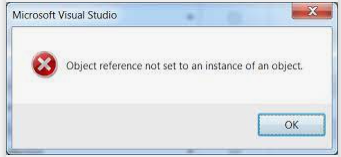
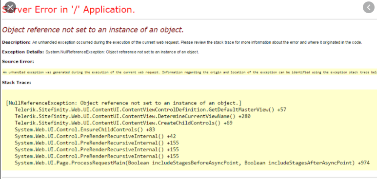

# C# Language Features - Dealing With null

## The Error You Will All See
It is inevitable that, at some point, you will see errors like the following if you are developing with .NET.


### Why does it happen?
The error "Object reference not set to an instance of an object" can come from a variety of sources, but it always means the same thing:  
You are attempting to use an object or call operations on an object as if it exists, but IT IS NULL

## Nullable Value Types
C# has two types of objects, value types and reference types. As you have learned about with C++, value types are those whose value can be stored directly on the stack, whereas reference types are those whose reference (think pointer) is stored on the stack, but actual data is stored on the heap.  Because of this distinction, it does not make any sense for a value type to be null.  Sometimes, however, that is exactly what we want.
### The Problem
```csharp
public class Child{
    public string Name {get;set;}
    public int Age {get;set;}
}
...
Child child = new Child();
child.Name = "Bob";
```
In the previous code example, what is `child.Age`?  I'll give you a hint, it's not null.  The default value of an int is 0.  In some contexts, this could be misleading.  Is the child 0 because Age was never set, or are they 0 because they're less than 1 year old?

### The Solution
The type Nullable<T> was introduced to solve this problem.  This is a templated value type that has two properties:  
bool HasValue - Whether or not it is null  
object Value - a reference to the actual type instance (now stored on the heap) or null
```csharp
public class Child{
    public string Name {get;set;}
    public int? Age {get;set;}
}
...
Child bob = new Child();
child.Name = "Bob";
```
What is `child.Age` now?  That's right, it's null and we can now tell the difference between an empty value and 0.

## Null-Conditional 
You may have noticed the use of `?` to define a nullable value type.  C# builds on that theme with the Null Conditional.

We could write this to ensure we don't hit a null reference:
```csharp
Child bob = null;

int? age;
if(bob != null)
{
    youngestAge = bob.Age;
}
else
{
    age = null;
}
```
```csharp
Child bob = null;

int? age = bob?.Age;
```
The two blocks are equivalent, only the second one is much easier to read once you understand the syntax.

## Null Coalescing Operators
Now we'll go one step further.  The null-coalescing operator allows us to say what to return if an expression evaluates to null.

Again, here is a wordy example, where we want to use the value "0" if Age is not defined.
```C#
//This is the basic setup for the below examples
List<Child> children = new List<Child>();
children.Add(new Child(){Name = "Bob"});
children.Add(new Child(){Name = "Sally", Age=5});
children.Add(null); //Oops!
int totalAge = 0;
```
```csharp
for(int i = 0; i < children.Count; i++)
{
    if(children[i] != null && children[i].Age != null)
    {
        totalAge += children[i].Age;
    }
    else
    {
        totalAge += 0;
    }
}
```
Let's make this nice with the null-coalescing operator
```csharp
for(int i = 0; i < children.Count; i++)
{
    totalAge += children[i]?.Age ?? 0;
}
```
In the second example, if either children[i] is null, or children[i].Age are null, then the whole left side of the coalescing operator, `??` is null, and the expression will return the value on the right side of the operator