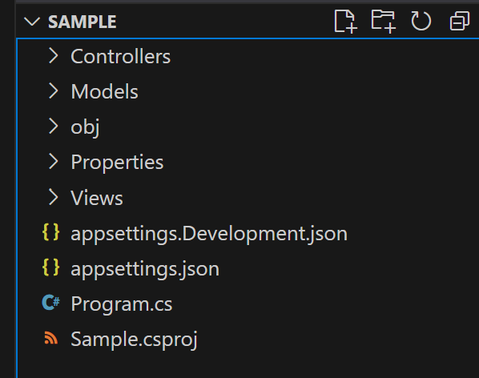

# Intro to ASP.NET MVC

## Folder Structure
When using ASP.NET MVC, there are three folders that are part of the standard convention of a project: `Models`, `Views` and `Controllers`



### Models
The `Models` folder is the place to put code files for your models.  There is no requirement that code files for models must be placed here, but it is the prevalent convention. These files will have a `.cs` extension when working with C#.

#### View Models vs Data Models
The models we are talking about with regards to MVC I may also refer to as `View Models`.  The purpose of distinguishing them is because they will often be specialized for the purpose of passing information to/from the view.  Data Models are similar, but are often specialized for passing information to/from the data layer/database.  

### Controllers
The `Controllers` folder is the place to put code files for your controllers.  There is no requirement that code files for controllers must be placed here, but it is the prevalent convention. These files will have a `.cs` extension when working with C#.

### Views
The `Views` folder is the place to put Razor templates for your MVC application.  This is a built-in search location for ASP.NET to automatically find views.  Technically, you could instruct ASP.NET to look for view templates elsewhere, but you would be fighting both convention and default ASP.NET functionality so it's not advisable.  These files will have a `.cshtml` extension when working with C#.

## How is the Controller Accessed?
If you fire up a simple local ASP.NET project, you may wonder how it is able to take the incoming URL  and figure out what to do with it. 


How does it take 
`Program.cs`
```csharp
var builder = WebApplication.CreateBuilder(args);
builder.Services.AddControllersWithViews();
var app = builder.Build();


app.UseStaticFiles();

app.MapDefaultControllerRoute(); 

app.Run();
```

`HomeController.cs`
```csharp
public class HomeController : Controller
{
    public IActionResult Index()
    {
        return View();
    }
}
```

If you fire this up, what happens when you access `https://localhost:5000/`  ?  It will execute the Index action of HomeController.

###  But How?  Basic Routing
When the web application starts, it uses reflection to load all objects that inherit from `Controller`. It is also **required** that the names of controller classes end with `Controller` (like `HomeController`) in order to be recognized for this purpose.  The routing middleware will inspect the incoming path in the request, and use it to determine which controller to use, which method to call, and what parameters to pass to it.  Let's take another look at the route setup:

The statement
```csharp
app.MapDefaultControllerRoute(); 
```
is equivalent to:
```csharp
app.MapControllerRoute(
    name: "default",
    pattern: "{controller=Home}/{action=Index}/{id?}");
```
This defines a route named "default" with a pattern for incoming URLs

`{controller}` will match the name of a controller

`{controller=Home}` is similar, but specifies the controller to use if this is omitted
___
`{action}` will match the name of a method on a controller to use

`{action=Index}` is similar, but specifies the action to call if this is omitted
___
`{id}` specifies a parameter for the action named id

`{id?}` denotes that the id paramter is optional
___

Because defaults are specified, The routes `/`, `/home` and `/home/index` and `/home/index/1` would all map to the same place.  `/home/index/1/2` would result in a 404 error, however because there is an additional parameter in the path, and nothing in the pattern identifies how to handle it.  We will talk more about routing next week.