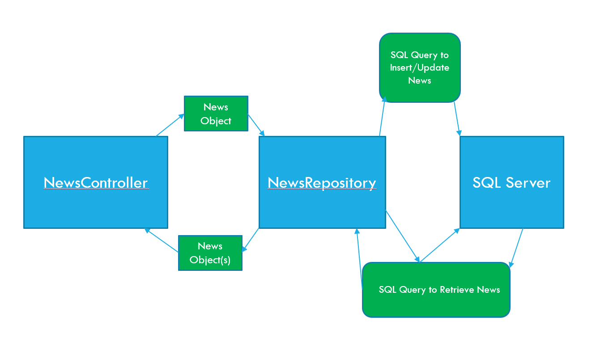

# The Repository Pattern
Repository is a programming design pattern which separates out the storing/retrieving of data from the business logic of your application 

When applied more specifically to an ASP.NET application, it may look something like this:
;

