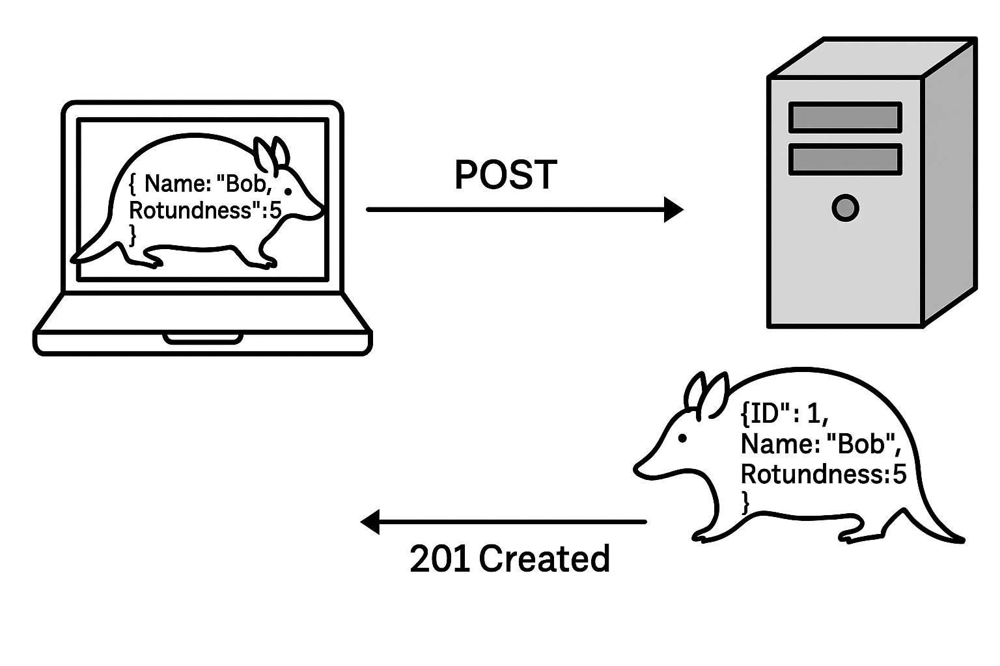

# RESTful Web Services
The majority of APIs available on the web today follow the REST pattern.  It is important to understand that there is no enforcement of the way a RESTful API has to be built. These are simply guidelines that help provide the most meaningful experience to the users of your API.

## Request Patterns
### URL Structure Defines Resources
RESTful URLs should be intuitive and follow a hierarchical structure that represents resources (nouns) and their relationships, not actions (verbs)

**Good:**
- `/users` - All users
- `/users/123` - User with ID 123
- `/users/123/orders` - Orders for user 123

**Bad:**
- `/getUsers`
- `/getUserById/123`
- `/retrieveUserOrders/123`

### HTTP Methods Define Actions
Use HTTP methods to specify the action on resources:
|Method|Purpose|
|-|-|
|**GET**|Retrieve a resource|
|**POST**|Create a new resource|
|**PUT**|Update/replace an entire resource|
|**PATCH**|Partially update a resource|
|**DELETE**|Remove a resource|

Examples:
- `GET /users` - Retrieve all users
- `GET /users/456` - Retrieve user 456
- `POST /users` - Create a new user
- `PUT /users/456` - Update user 456 (full replacement)
- `PATCH /users/456` - Partially update user 456
- `DELETE /users/456` - Delete user 456

### Nested Resources
Show relationships through URL hierarchy:

- `GET /users/123/orders` - Get orders for user 123
- `POST /users/123/orders` - Create new order for user 123
- `GET /users/123/orders/789` - Get specific order 789 for user 123
- `DELETE /users/123/orders/789` - Delete order 789 for user 123

### Query Parameters for Filtering
Use query parameters for filtering, sorting, and pagination:
- `GET /users?category=premium` - Filter users by category
- `GET /users?sort=name&order=desc` - Sort users by name descending
- `GET /users?page=2&limit=20` - Pagination
- `GET /users?active=true&role=admin` - Multiple filters

## Response Patterns
When building a REST API, the choices we make about the response are just as important and meaningful as those related to the request.

### Status Codes
We have already looked at many status codes in a previous section and briefly discussed how they relate to **pages**.  Let's take a look at how they relate to **APIs** now.

`GET /armadillos/456` - getting armadillo with ID 456
|Result|Status code|
|-|-|
|User Exists|200 OK|
|User Doesn't Exist|404 Not Found|

`POST /armadillos` - creating a armadillo user
|Result|Status code|
|-|-|
|User Created|201 Created|
|Invalid user data|400 Bad Request|

`PUT /armadillos/456` - updating armadillo with ID 456
|Result|Status code|
|-|-|
|User Updated|200 OK or 204 No Content|
|Invalid user data|400 Bad Request|
|User Doesn't Exist|404 Not Found|

`DELETE /armadillos/456` - deleting armadillo with ID 456
|Result|Status code|
|-|-|
|User Deleted|204 No Content|
|Invalid user data|400 Bad Request|
|User Doesn't Exist|404 Not Found|

### Return Values
In the `PUT` example above, you may have noticed that the return type may either be `200 OK` or `204 No Content`.  

#### What's the difference?  
`204` is a succesfful status code, just like `200`, but signifies that the client should not expect any data in the response.  When it comes to **creating** and **updating** records, it is not uncommon for APIs to return the record in the response.  This is especially helpful when creating records because the client may want to know the ID or other information about the record that doesn't exist until after it is created. 

