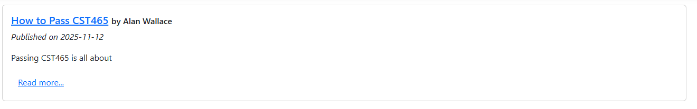

# Lab 6/Assignment 4
In this Lab, we will be building a basic blogging application.  This is going to be a bit more involved, so I will be counting it for both a lab and assignment.  It will be worth 30 points total, and like a lab, will be all or nothing.

You can certainly use VS Code if you choose, but I highly recommend switching to the full Visual Studio Community Edition at this point because it will make some of the tasks much easier.

I also recommend you check out the [Bootstrap Grid component](https://getbootstrap.com/docs/5.3/layout/grid/).  It can help you create great layouts.

## Project Setup
1. Create a new folder in your CST465 repository named Lab 6
1. Create a new project in the folder.  We are going to use the MVC template to let it generate some of the basics out of the box for us:
```bash
dotnet new mvc
```
You will now have a project with all the basics set up for you already including MVC folder structure, a layout file, and routing configured.

## Database Setup

I have created databases for each of you.  To connect from SQL Server Management Studio, use the following information:

**Server name:** cst465.database.windows.net  
**Authentication:** SQL Server Authentication  
**Login:** <firstname.lastname>  
**Password:** Hootie<last 4 of 918#>!

Don't forget the exclamation at the end of the password above

**IMPORTANT** (On the "Options" tab) Connect to Database: <firstname.lastname>


Open a new query window and execute the following statements
```sql
--Create a table for Blog Posts
CREATE TABLE [dbo].[BlogPost] (
    [ID] INT IDENTITY(1,1) NOT NULL,
    [Title] VARCHAR(200) NOT NULL,
    [Content] VARCHAR(MAX) NOT NULL,
    [Author] VARCHAR(100) NOT NULL,
    [Timestamp] DATETIME NOT NULL DEFAULT(getdate()),
    CONSTRAINT [PK_BlogPost] PRIMARY KEY CLUSTERED ([ID])
);
GO

--Create stored procedures for saving/retrieving data
CREATE PROCEDURE BlogPost_Upsert
(
	@ID int = NULL,
	@Title varchar(200),
	@Content varchar(MAX),
	@Author varchar(100)
)
AS
BEGIN
	IF @ID IS NULL
	BEGIN
	    INSERT INTO BlogPost(Title, Content, Author) VALUES (@Title, @Content, @Author)
	END
	ELSE
	BEGIN
	    UPDATE BlogPost 
        SET Title=@Title, Content=@Content, Author=@Author
	    WHERE ID=@ID
	END
END
GO

CREATE PROCEDURE BlogPost_GetList
AS
BEGIN
	SELECT *
	FROM BlogPost
	ORDER BY Timestamp DESC 
END
GO

CREATE PROCEDURE BlogPost_Get
(
    @ID int
)
AS
BEGIN
	SELECT *
	FROM BlogPost
    WHERE ID=@ID
	ORDER BY Timestamp DESC 
END
GO
```

## Connection Configuration

### Add the Connection String to the Project
Right-click on your project name and select "Manage User Secrets".  This will bring up a file that you can edit.  Replace the contents with this, except you will replace the instances of "john.doe" with your firstname.lastname and replace the password with Hootie<last 4 of your 918#>!

{
    "ConnectionStrings" :{
        "DB_BlogPosts": "Server=cst465.database.windows.net;Database=john.doe;User ID=john.doe;Password=Hootie1111!"
    }
}
 

## Blog Configuration
1. Create a `Config` folder in your `Lab 6` folder 
1. Add a new configuration file named `BlogConfig.json`
1. Add the appropriate line to `Program.cs` to load this configuration file.  Make sure to include the parameter that allows it to pick up changes automatically
1. Define a structure in your config file that will define the following things:
    ```
    BlogConfig
        -DateFormat
        -SummaryWordCount
    ```

1. Create a new class in your project named `BlogConfig` and set up the mapping in `Program.cs` so that the configuration can be automatically mapped to your class
1. When interpreting DateFormat, the possible values you will use are `Standard` or `USA`.
    - **Standard**: will use the format string yyyy-MM-dd
    - **USA**: will use th format strig MM/dd/yyyy

## Building the Blog

- Define both a `BlogPost` class and a `BlogPostModel` class.  
    - `BlogPost` will be used for saving to the database.  
    - `BlogPostModel` will be the model that contains validation logic. All fields are required, but you do not need to set ID or Timestamp for insert as they will be generated automatically by the database. 
    - Given that you will have to do conversions between `BlogPost` and `BlogPostModel`, create two extensions methods:
        - `ToViewModel()` which will operate on a `BlogPost` object and return a new `BlogPostModel` object with the fields set.
        - `ToDataModel()` which will operate on a `BlogPostModel` object and return a new `BlogPost` object with the fields set
- Use a controller named `BlogController`
- Implement Views/Actions for:
    
    - Showing the list of posts (default)  
        - Utilize the [Bootstrap Card component](https://getbootstrap.com/docs/5.3/components/card/) for rendering each post entry. You can make it look howeverou like, but all of the data shold be there. Here is an example of how it might look:
        
        - The DateFormat config setting must be respected when rendering the Timestamp for the post
        - The title should be a link to the page for a single post
        - Only the first [SummaryWordCount] words of a blog post should be shown.  If there are more than [SummaryWordCount] words, a link should display that says (read more...) and directs the user to the the page for a single post
    - Showing a single post
        - an ID parameter will be passed in the route to determine which one to display
    - Creating a new post
        - Use Bootstrap for form styling.  You will likely only need to inspect how `form-label` and `form-control` classes work. 
    - Editing an existing post
        - an ID parameter will be passed in the route to determine which one to edit
        - The Timestamp can be ignored in the form, it is managed by the server.
        - Use Bootstrap for form styling
- Use the repository pattern for interacting with the database.  When calling the upsert procedure, the following may come in handy:
    ```csharp
    if(blogPost.ID != null) //Can also check blogPost.ID != 0 if you are not using a nullable int for the ID
    {
        command.Parameters.AddWithValue("@ID", blogPost.ID);
    }
    ```
    - Create extension methods as shown in the course content so that you can make calls like:
    ```csharp
    reader.GetInt32("ID");
    reader.GetString("Title");
    ```
- Dependency Injection must be utilized for instantiating the repository within the controller

Demo your blog to me when you are done.