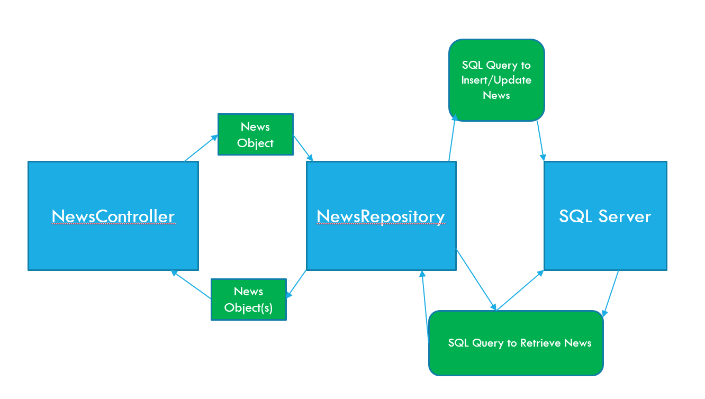

# The Repository Pattern
Repository is a programming design pattern which separates out the storing/retrieving of data from the business logic of your application 


When applied more specifically to an ASP.NET application, it may look something like this:
;


## Building a Repository
The first step when building a repository is to define an interface.  This is a critical step because it defines how other parts of your application will interact with the data storage, while remaining independent of a specific implementation
`IArmadilloRepository.cs`
```csharp
public interface IArmadilloRepository
{
    Armadillo Get(string name);
    IEnumerable<Armadillo> GetList();
    void Save(Armadillo armadillo);
    void Delete(string name);
}
```

Now that we know how our repository will work, we can define an implementation.  Since we just learned about connecting to SQL server, we will use that in our example.  Here is a complete implementation:

`SqlArmadilloRepository.cs`
```csharp
using Microsoft.Extensions.Configuration;
using Microsoft.Data.SqlClient;
using System.Data;
namespace ArmadilloFarm;

public class SqlArmadilloRepository : IArmadilloRepository
{
    
    private readonly IConfiguration _Config;
    public SqlArmadilloRepository(IConfiguration config)
    {
        _Config = config;
    }

    public Armadillo Get(string name)
    {
        //We're going to cheat for brevity.  This is NOT the most performant way, but it works well for small datasets and demonstration purposes
        return GetList().FirstOrDefault(a => a.Name.Equals(name, StringComparison.OrdinalIgnoreCase));
    }

    public IEnumerable<Armadillo> GetList()
    {
        List<Armadillo> armadillos = new List<Armadillo>();
        using SqlConnection connection = new SqlConnection(_Config.GetConnectionString("SomeDB"));
        using SqlCommand command = new SqlCommand();
        command.Connection = connection;
        command.CommandType = CommandType.Text;
        command.CommandText = "SELECT Name, Rotundness FROM ArmadilloFarm ORDER BY Name";
        try
        {
            connection.Open();
            using SqlDataReader reader = command.ExecuteReader();

            //Each call to reader.Read() will attempt to get a single record from the result set.  It returns true if there is a row to read, false otherwise
            while(reader.Read()) 
            {
                Armadillo armadillo = new Armadillo();
                //The following two lines assume that you have extension methods in place as we previously learned about
                armadillo.Name = reader.GetString("Name");
                armadillo.Rotundness = reader.GetInt32("Rotundness");

                //Add the armadillo to the list
                armadillos.Add(armadillo);
            }
        }
        catch(Exception ex)
        {
            //Handle exception
        }
        return armadillos;
    }

    public void Save(Armadillo armadillo)
    {
        //Check if the armadillo already exists
        bool exists = GetList().Any(a => a.Name.Equals(armadillo.Name, StringComparison.OrdinalIgnoreCase));
        //We are going to perform what is known as an "upsert" operation - if the record exists, we update it, otherwise we insert it
        using SqlConnection connection = new SqlConnection(_Config.GetConnectionString("SomeDB"));
        using SqlCommand command = new SqlCommand();
        command.Connection = connection;
        command.CommandType = CommandType.Text;
        if(!exists)
        {
            command.CommandText = "INSERT INTO ArmadilloFarm (Name, Rotundness) VALUES (@Name, @Rotundness)";
        }
        else
        {
            command.CommandText = "UPDATE ArmadilloFarm SET Rotundness = @Rotundness WHERE Name = @Name";
        }
        command.Parameters.AddWithValue("@Name", armadillo.Name);
        command.Parameters.AddWithValue("@Rotundness", armadillo.Rotundness);   
        try
        {
            connection.Open();
            command.ExecuteNonQuery(); //Returns the number of rows affected
        }
        catch(Exception ex)
        {
            //Handle exception
        }
    }

    public void Delete(string name)
    {
        using SqlConnection connection = new SqlConnection(_Config.GetConnectionString("SomeDB"));
        using SqlCommand command = new SqlCommand();
        command.Connection = connection;
        command.CommandType = CommandType.Text;
        
        command.CommandText = "DELETE FROM ArmadilloFarm WHERE Name = @Name";
        
        command.Parameters.AddWithValue("@Name", name);
        
        try
        {
            connection.Open();
            command.ExecuteNonQuery(); //Returns the number of rows affected
        }
        catch(Exception ex)
        {
            //Handle exception
        }
    }
}
```
### Registering the Repository
In order to use this repository, we will need to register it in our **dependency injection container**

`Program.cs`
```csharp
var builder = WebApplication.CreateBuilder(args);
builder.Services.AddTransient<IArmadilloRepository, SqlArmadilloRepository>();
var app = builder.Build();
```